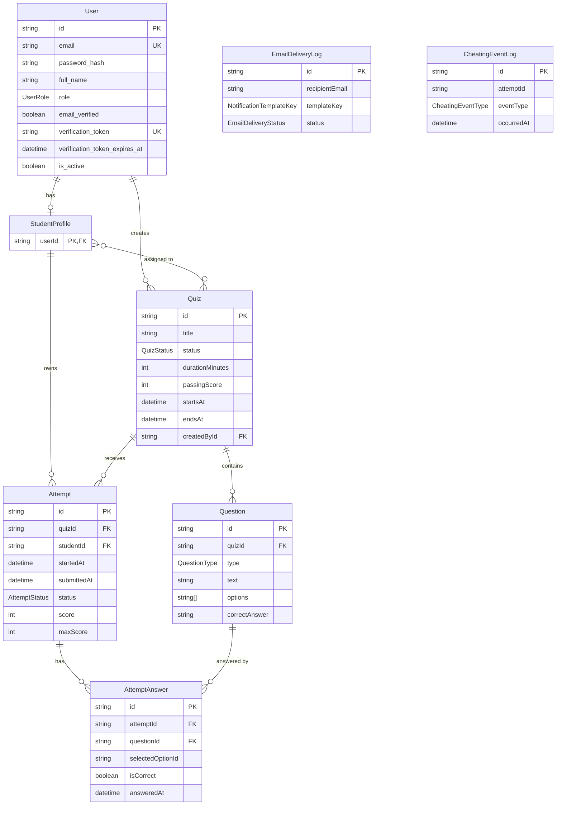

# Database Documentation

PostgreSQL database for the Quiz Service backend.

- **ORM:** Prisma 7
- **Provider:** PostgreSQL 16
- **ID strategy:** `cuid()` string primary keys across all domain tables
- **Schema file:** `schema.prisma`

## Entity Relationship Overview



## Enums

| Enum | Values | Used by |
|---|---|---|
| `UserRole` | `STUDENT`, `ADMIN` | `users.role` |
| `QuizStatus` | `DRAFT`, `PUBLISHED` | `quizzes.status` |
| `QuestionType` | `MCQ`, `TRUE_FALSE` | `questions.type` |
| `AttemptStatus` | `IN_PROGRESS`, `SUBMITTED`, `TIMED_OUT`, `ABANDONED` | `attempts.status` |
| `EmailDeliveryStatus` | `PENDING`, `SENT`, `FAILED`, `RETRYING` | `email_delivery_logs.status` |
| `NotificationTemplateKey` | `VERIFICATION`, `QUIZ_INVITATION` | `email_delivery_logs.templateKey` |
| `CheatingEventType` | `TAB_HIDDEN`, `WINDOW_BLUR`, `WINDOW_FOCUS`, `FULLSCREEN_EXIT`, `COPY_PASTE`, `OTHER` | `cheating_event_logs.eventType` |

## Tables

### `users`

Authentication and identity.

| Column | Type | Notes |
|---|---|---|
| `id` | `TEXT` PK | `cuid()` |
| `email` | `TEXT` UNIQUE | Login identifier |
| `password_hash` | `TEXT` | bcrypt hash |
| `full_name` | `TEXT` NULL | Display name |
| `role` | `UserRole` | `STUDENT` or `ADMIN` |
| `email_verified` | `BOOLEAN` | Default `false`; Sprint 2 verification flow updates this |
| `verification_token` | `TEXT` UNIQUE NULL | Issued on registration |
| `verification_token_expires_at` | `TIMESTAMPTZ` NULL | Optional expiry |
| `is_active` | `BOOLEAN` | Account enabled flag |
| `created_at` | `TIMESTAMPTZ` | |
| `updated_at` | `TIMESTAMPTZ` | |

**Relations**

- One optional `student_profiles` row when `role = STUDENT`
- Creates quizzes via `quizzes.createdById`

### `student_profiles`

Student-specific profile layer separate from auth credentials.

| Column | Type | Notes |
|---|---|---|
| `userId` | `TEXT` PK, FK → `users.id` | Same value as the student's user id |

**Relations**

- Many-to-many with `quizzes` through `_QuizToStudentProfile` (quiz assignments / invitations)
- One-to-many `attempts` via `attempts.studentId`

**Important:** `attempts.studentId` references `student_profiles.userId`, not `users.id` directly. A `StudentProfile` row is created automatically when a student registers.

### `quizzes`

Admin-owned quiz records.

| Column | Type | Notes |
|---|---|---|
| `id` | `TEXT` PK | `cuid()` |
| `title` | `TEXT` | |
| `description` | `TEXT` NULL | |
| `status` | `QuizStatus` | `DRAFT` or `PUBLISHED` |
| `durationMinutes` | `INT` NULL | Optional time limit |
| `passingScore` | `INT` NULL | Optional pass threshold |
| `startsAt` | `TIMESTAMP` NULL | Availability window start |
| `endsAt` | `TIMESTAMP` NULL | Availability window end |
| `createdById` | `TEXT` NULL, FK → `users.id` | Admin creator |
| `createdAt` | `TIMESTAMP` | |
| `updatedAt` | `TIMESTAMP` | |

**Relations**

- `questions`, `attempts`
- Assigned students through `_QuizToStudentProfile`

### `_QuizToStudentProfile`

Implicit Prisma join table for quiz ↔ student assignments.

| Column | Type | Notes |
|---|---|---|
| `A` | `TEXT` FK → `quizzes.id` | Quiz id |
| `B` | `TEXT` FK → `student_profiles.userId` | Student profile id |

Students only see quizzes they are linked to in this table (L4 student list filter).

### `questions`

Question bank entries belonging to a quiz.

| Column | Type | Notes |
|---|---|---|
| `id` | `TEXT` PK | `cuid()` |
| `quizId` | `TEXT` FK → `quizzes.id` | Cascade delete with quiz |
| `type` | `QuestionType` | `MCQ` or `TRUE_FALSE` |
| `text` | `TEXT` | Question prompt |
| `options` | `TEXT[]` | MCQ option labels (string array for MVP) |
| `correctAnswer` | `TEXT` | Correct option value |
| `createdAt` | `TIMESTAMP` | |
| `updatedAt` | `TIMESTAMP` | |

**Note:** There is no separate `question_options` table in Sprint 1. `selectedOptionId` on answers stores the chosen option string, not a UUID FK.

### `attempts`

One student's run at one quiz.

| Column | Type | Notes |
|---|---|---|
| `id` | `TEXT` PK | `cuid()` |
| `quizId` | `TEXT` FK → `quizzes.id` | |
| `studentId` | `TEXT` FK → `student_profiles.userId` | |
| `startedAt` | `TIMESTAMP` | Set when attempt starts |
| `submittedAt` | `TIMESTAMP` NULL | Set on submit |
| `status` | `AttemptStatus` | Lifecycle state |
| `score` | `INT` NULL | Filled by scoring (Sprint 2) |
| `maxScore` | `INT` NULL | Filled by scoring (Sprint 2) |
| `createdAt` | `TIMESTAMP` | |
| `updatedAt` | `TIMESTAMP` | |

### `attempt_answers`

Answers saved during or at the end of an attempt.

| Column | Type | Notes |
|---|---|---|
| `id` | `TEXT` PK | `cuid()` |
| `attemptId` | `TEXT` FK → `attempts.id` | Cascade delete |
| `questionId` | `TEXT` FK → `questions.id` | Unique per attempt |
| `selectedOptionId` | `TEXT` NULL | Chosen option string; `NULL` = skipped |
| `isCorrect` | `BOOLEAN` NULL | Filled by scoring (Sprint 2) |
| `answeredAt` | `TIMESTAMP` | Updated on each save |

**Constraint:** `UNIQUE (attemptId, questionId)`

### `email_delivery_logs`

Outbound email attempt audit trail (L7).

| Column | Type | Notes |
|---|---|---|
| `id` | `TEXT` PK | |
| `recipientEmail` | `TEXT` | |
| `subject` | `TEXT` | |
| `templateKey` | `NotificationTemplateKey` | |
| `status` | `EmailDeliveryStatus` | |
| `correlationId` | `TEXT` NULL | Trace id |
| `errorMessage` | `TEXT` NULL | Last failure reason |
| `attemptCount` | `INT` | Retry counter |
| `providerMessageId` | `TEXT` NULL | SMTP/provider id |
| `metadata` | `JSONB` NULL | Extra context |
| `lastAttemptAt` | `TIMESTAMP` NULL | |
| `deliveredAt` | `TIMESTAMP` NULL | |
| `createdAt` | `TIMESTAMP` | |
| `updatedAt` | `TIMESTAMP` | |

### `cheating_event_logs`

Integrity events captured during attempts (L7 / Sprint 2 scoring integration).

| Column | Type | Notes |
|---|---|---|
| `id` | `TEXT` PK | |
| `attemptId` | `TEXT` | Raw attempt id (no FK by design) |
| `eventType` | `CheatingEventType` | |
| `description` | `TEXT` NULL | |
| `metadata` | `JSONB` NULL | |
| `occurredAt` | `TIMESTAMP` | |
| `createdAt` | `TIMESTAMP` | |

## Migration History

| Migration | Purpose |
|---|---|
| `20260609213000_notifications_integrity_foundation` | Email delivery logs, cheating event logs |
| `20260610120000_questions_quizzes_users` | Users, quizzes baseline, questions |
| `20260610120000_attempts_data_model` | Attempts and attempt answers |
| `20260610211257_quiz_quiz_status` | Legacy quiz status table (superseded) |
| `20260615120000_schema_relations_student_profile` | Student profiles, FK relations, assignment join table |
| `20260615130000_consolidate_quizzes_table` | Merge legacy `Quiz` table into canonical `quizzes` |
| `20260615140000_align_users_auth_columns` | Align `users` table with auth model (role, password_hash, etc.) |

## Sprint 2 Schema Expectations

Planned work may add fields or tables without breaking Sprint 1 contracts:

| Owner | Likely changes |
|---|---|
| L1 Auth | Verification token expiry usage, no breaking user columns |
| L2 Quiz | Publish rules, possible assignment APIs using `_QuizToStudentProfile` |
| L3 Questions | Validation rules; optional future `QuestionOption` table |
| L5 Scoring | Populate `attempts.score`, `attempt_answers.isCorrect` |
| L7 Notifications | Real SMTP delivery writing to `email_delivery_logs` |

Coordinate all shared schema edits through `L3` before merging.

## Manual Inspection

```bash
# Visual browser
npm run prisma:studio

# psql inside Docker
docker exec -it quiz-service-postgres psql -U postgres -d quiz_service
```

Useful queries:

```sql
-- Students assigned to a quiz
SELECT sp."userId", u.email
FROM "_QuizToStudentProfile" j
JOIN student_profiles sp ON sp."userId" = j."B"
JOIN users u ON u.id = sp."userId"
WHERE j."A" = '<quiz-id>';

-- Attempts for a quiz
SELECT a.id, a.status, a.score, a."submittedAt"
FROM attempts a
WHERE a."quizId" = '<quiz-id>';
```
